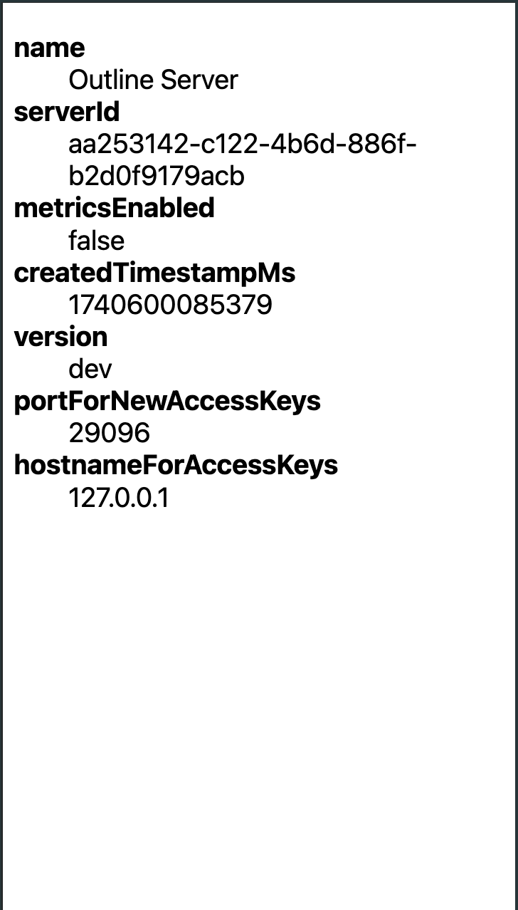
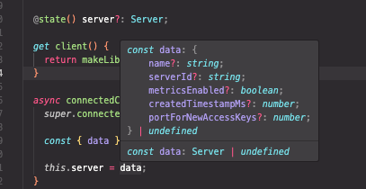

# Manager SDK Prototype

This is a prototype of a Manager SDK for the Outline Server.

It uses `ngrok` to allow the user to access the Management API from the browser.

It uses the `lit` library to create a web component that displays the server details.

It also uses `@hey-api/openapi-ts` to generate a TypeScript library from the Outline Server API definition.

## Setup

Get a`NGROK_TOKEN` from https://dashboard.ngrok.com/get-started/your-authtoken and a `NGROK_DOMAIN` from https://dashboard.ngrok.com/domains.

```sh
export NGROK_TOKEN=...
export NGROK_DOMAIN=...

# Start the local outline server
task shadowbox:start &

# Start the web app demo
npm run example --workspace sdk
```

Result:



## Library Generation

Generated library from `src/shadowbox/server/api.yml` with `@hey-api/openapi-ts`:

```bash
# run in project root
npx @hey-api/openapi-ts \
  -i src/shadowbox/server/api.yml \
  -o src/sdk/library/generated \
  -c @hey-api/client-fetch
```

Intellisense example:



## TODOs

- [ ] Why does Prometheus continuously crash (had to comment it out)
- [ ] Generate Library on API change
- [ ] ...
